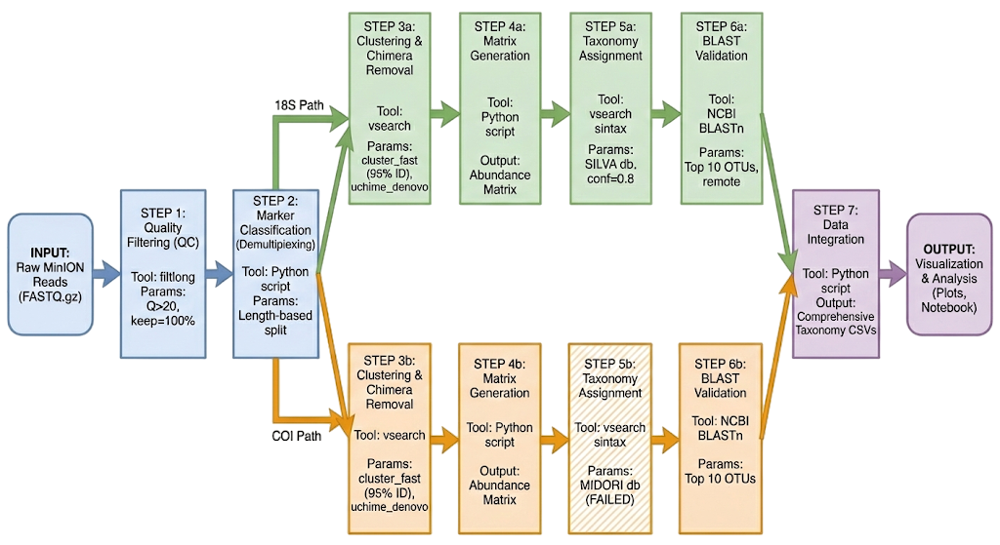

# eDNA Metabarcoding Pipeline for MinION

This pipeline processes multi-marker amplicon sequencing data (18S rRNA, COI, and JEDI) from aquatic or terrestrial eDNA samples sequenced on Oxford Nanopore MinION. It takes raw FASTQ files and produces abundance-based OTU matrices with taxonomy assignments ready for statistical analysis.

## Supported Markers

| Marker | Target Gene | Amplicon Size | Typical Use | Default Database |
|--------|------------|---------------|-------------|-----------------|
| **18S** | 18S rRNA | 1,500–2,800 bp | Water eDNA (eukaryotes) | PR2 v5.1.1 |
| **COI** | Cytochrome Oxidase I | 500–900 bp | Water/Soil (invertebrates, Folmer primers) | MIDORI2 |
| **JEDI** | SSU rRNA V4-V5 (515F-Y/926R) | 250–500 bp | Soil eDNA (all domains of life) | PR2 v5.1.1 |

### Available Reference Databases

| Database | Gene | Size | Best For | Setup |
|----------|------|------|----------|-------|
| **PR2 v5.1.1** | 18S rRNA | ~240K seqs | Protists, ciliates, diatoms, plankton | `bash refs/setup_pr2_18s.sh` |
| **SILVA v123** | 18S rRNA | ~1.1 GB UDB | Broad 18S coverage | Manual (see below) |
| **MIDORI2** | COI | 3.1M seqs, 9.4 GB | Broadest COI, best at species level | Manual + `bash refs/build_coi_udb.sh` |
| **eKOI** | COI | 66 MB | Curated eukaryote COI, fast | Manual + convert script |
| **Porter CO1 v5.1** | COI | 2.2M seqs, 6.8 GB | Good intermediate COI coverage | `bash refs/setup_porter_coi.sh` |

## Key Features

* **Marker-Aware:** Automatically separates 18S, COI, and JEDI reads based on amplicon length. Use `--markers` to select which markers to search for.
* **Multi-Database:** Supports 5 reference databases with `--db_18S`, `--db_COI`, `--db_JEDI` flags. Defaults to PR2 (18S/JEDI) and MIDORI2 (COI).
* **Noise Reduction:** Uses `filtlong` for quality filtering and VSEARCH `uchime_denovo` for chimera removal.
* **High Accuracy:** Generates consensus sequences for OTUs to correct Nanopore sequencing errors.
* **Taxonomy Ready:** SINTAX classification with confidence scores at all taxonomic ranks + optional BLAST validation.

## Pipeline Overview



### Pipeline Steps

1. **Quality Filtering** (`scripts/1_run_preprocessing.py`) — Filter reads using `filtlong` (mean Q ≥ 20).
2. **Marker Classification** (`scripts/2_classify_markers.py`) — Separate reads by amplicon length:
   - 18S: 1500–2800 bp | COI: 500–900 bp | JEDI: 250–500 bp
3. **Clustering + Chimera Detection** (`scripts/3_run_clustering_by_marker.py`) — VSEARCH clustering (95% identity), consensus generation, chimera removal.
4. **Abundance Matrix Generation** (`scripts/4_merge_otu_tables_by_marker.py`) — Create per-sample OTU count tables.
5. **Taxonomy Assignment** (`scripts/5_assign_taxonomy.py`) — SINTAX classification against reference databases.
6. **BLAST Validation** (`scripts/6_blast_top_otus.py`) — Optional BLAST checks for top OTUs.
7. **Reporting** (`scripts/7_comprehensive_taxonomy_summary.py`) — Merge abundance, taxonomy, and BLAST results into a final master CSV.

## Installation and Setup

### 1. Prerequisites

Unix-based system (macOS or Linux). The pipeline runs in a local Conda environment.

### 2. Create the Environment

```bash
# Automated (uses mamba if available, falls back to conda)
bash create_env.sh

# Or manually
conda env create -f environment.yml -p ./env
```

Tools installed: filtlong, vsearch (v2.30+), python 3.10, minimap2, samtools, biopython, pandas, matplotlib, seaborn.

## Database Setup

Reference databases go in `refs/`. The pipeline auto-detects available databases at runtime.

### 18S / JEDI Databases (rRNA)

**PR2 v5.1.1** (recommended — best for protists, ciliates, diatoms):
```bash
bash refs/setup_pr2_18s.sh
```
This downloads PR2 v5.1.1, converts it to SINTAX format using `refs/convert_pr2_to_sintax.py`, and builds the UDB.

**SILVA v123** (broader coverage, lower resolution):
```bash
cd refs/
wget https://www.drive5.com/sintax/silva_18s_v123.fa.gz
gunzip silva_18s_v123.fa.gz
../env/bin/vsearch --makeudb_usearch silva_18s_v123.fa --output silva_18s_v123.udb
cd ..
```

### COI Databases

**MIDORI2** (recommended — largest COI database, best at species rank):
1. Download the SINTAX-formatted FASTA from [MIDORI2](http://www.reference-midori.info/download.php) (GB269, CO1, SINTAX format)
2. Place it in `refs/` as `MIDORI2_UNIQ_NUC_SP_GB269_CO1_SINTAX.fasta`
3. Build the UDB:
```bash
bash refs/build_coi_udb.sh
```

**eKOI** (curated eukaryote COI, small and fast):
1. Download from [eKOI](https://doi.org/10.1101/2024.12.05.626972) the PR2-formatted FASTA
2. Convert to SINTAX format and build UDB:
```bash
python3 refs/convert_ekoi_to_sintax.py --input refs/eKOI_raw.fasta --output refs/eKOI_COI_SINTAX.fasta
./env/bin/vsearch --makeudb_usearch refs/eKOI_COI_SINTAX.fasta --output refs/eKOI_COI.udb
```

**Porter CO1 v5.1** (pre-built, good intermediate coverage):
```bash
bash refs/setup_porter_coi.sh
```
This downloads the pre-built SINTAX UDB from the [CO1Classifier](https://github.com/terrimporter/CO1Classifier) releases.

## How to Run

### Both Datasets (Recommended)

```bash
conda activate ./env

# Run Water (18S+COI) then Soil (JEDI+COI) sequentially
bash scripts/run_both_datasets.sh

# Override databases via environment variables:
DB_18S=silva DB_COI=ekoi bash scripts/run_both_datasets.sh
```

### Single Dataset

```bash
# Water eDNA (18S + COI) — defaults to PR2 + MIDORI2
bash scripts/run_full_pipeline.sh \
    --root data/Water_eDNA_18S_COI_14_01_26/fastq_pass \
    --markers 18S,COI \
    --threads 14

# Soil eDNA (JEDI + COI)
bash scripts/run_full_pipeline.sh \
    --root data/Soil_eDNA_JEDI_COI_14_01_26/fastq_pass \
    --markers JEDI,COI \
    --threads 14

# Override databases explicitly:
bash scripts/run_full_pipeline.sh \
    --root data/Water_eDNA_18S_COI_14_01_26/fastq_pass \
    --markers 18S,COI \
    --db_18S silva --db_COI ekoi \
    --threads 14
```

Database arguments: `--db_18S` (pr2/silva), `--db_COI` (midori2/ekoi/porter), `--db_JEDI` (pr2/silva). You can also pass a direct path to a `.udb` file.

### Background Mode

```bash
nohup bash scripts/run_full_pipeline.sh \
    --root data/Water_eDNA_18S_COI_14_01_26/fastq_pass \
    --markers 18S,COI --threads 14 \
    > pipeline_water.log 2>&1 &

tail -f pipeline_water.log
```

### Re-run Taxonomy Only

To re-assign taxonomy with a different database without re-running the full pipeline:

```bash
# Re-run with PR2 for 18S and Porter for COI
bash scripts/regenerate_taxonomy.sh --db_18S pr2 --db_COI porter --dataset water

# All options
bash scripts/regenerate_taxonomy.sh --dataset water|soil|both --db_18S DB --db_COI DB --db_JEDI DB
```

### Step-by-Step (For Debugging)

```bash
# Step 1: Quality Filter
python3 scripts/1_run_preprocessing.py \
    --input_files data/sample_01/*.fastq.gz \
    --output_dir out/sample_01

# Step 2: Separate markers
python3 scripts/2_classify_markers.py --input_dir "out/run_name" --markers 18S,COI

# Step 3: Cluster and Remove Chimeras
python3 scripts/3_run_clustering_by_marker.py \
    --input_dir "out/run_name" --markers 18S,COI --threads 12

# Step 4: Create Abundance Matrices
python3 scripts/4_merge_otu_tables_by_marker.py --input_dir "out/run_name"

# Step 5: Assign Taxonomy
python3 scripts/5_assign_taxonomy.py \
    --input_dir "out/run_name" \
    --db_18S refs/pr2_18S_v511.udb \
    --db_COI refs/midori2_COI.udb \
    --threads 12

# Step 6 (optional): BLAST top OTUs
python3 scripts/6_blast_top_otus.py \
    --input_dir "out/run_name" --marker 18S

# Step 7: Generate Final Report
python3 scripts/7_comprehensive_taxonomy_summary.py --input_dir "out/run_name"
```

**Example log:** See [logs_example/](logs_example/) for a complete pipeline execution log.

## Output Files

After the pipeline finishes, results are in `out/<run_name>/`.

| Directory | Contents |
|-----------|----------|
| `merged/` | OTU abundance matrices (raw counts + relative abundance per marker) |
| `temp_clustering/` | Consensus FASTA sequences (chimera-filtered) |
| `taxonomy/` | Per-OTU SINTAX assignments with confidence scores |
| `taxonomy_summary/` | **Master CSVs** — abundance + taxonomy + BLAST merged per marker |
| `logs/` | Per-sample and per-step logs |

The `taxonomy_summary/comprehensive_taxonomy_{marker}.csv` files are ready for direct import into R or Python. Each row is an OTU with columns for: OTU ID, total abundance, per-sample abundances, taxonomy at all ranks with confidence scores, and BLAST results.

## Analysis Notebooks

| Notebook | Description |
|----------|-------------|
| `Water_results_analysis SILV-MIDO.ipynb` | Water results with SILVA (18S) + MIDORI2 (COI) |
| `Water_results_analysis SILV-eKOI.ipynb` | Water results with SILVA (18S) + eKOI (COI) |
| `Water_results_analysis PR2-Porter.ipynb` | Water results with PR2 (18S) + Porter (COI) |
| `Soil_results_analysis SILV-MIDO.ipynb` | Soil results with SILVA (JEDI) + MIDORI2 (COI) |
| `Soil_results_analysis SILV-eKOI.ipynb` | Soil results with SILVA (JEDI) + eKOI (COI) |
| `Soil_results_analysis PR2-Porter.ipynb` | Soil results with PR2 (JEDI) + Porter (COI) |
| `Presentation_eDNA_Results.ipynb` | Summary presentation with DB comparison plots |
| `results_analysis.ipynb` | Presentation notebook (generates PPTX) |

Each analysis notebook includes: confidence dashboards, DB performance comparison, taxonomy bar plots, BLAST validation, cross-marker analysis, and Top 20 Eukaryotic Genera plots (filtered by confidence ≥ 0.8).

## Methodology Notes

- **Nanopore-specific:** No PCR duplicate removal (dereplication) before clustering — Nanopore reads each originate from a unique molecule, so pre-clustering dereplication has no effect. Post-clustering dereplication of consensus sequences is a potential improvement when merging multiple runs.
- **Classification:** Reads are separated by amplicon length. JEDI (250–500 bp) targets the same rRNA gene family as 18S but with different primers (515F-Y/926R), so it uses an 18S/SSU database (PR2 or SILVA), not a COI database.
- **Clustering:** VSEARCH at 95% identity with consensus generation to correct Nanopore errors. Chimeras removed with `uchime_denovo`.
- **Confidence filtering:** Taxonomy assignments include per-rank confidence scores (0–1). Analysis notebooks filter at confidence ≥ 0.8 by default.

## Next Steps

### Priority

1. **Ciliate blocking primers:** COI results are dominated by ciliate sequences (Oligohymenophorea, Intramacronucleata). Implement blocking primers to suppress ciliate amplification and increase vertebrate/invertebrate detection.
2. **Local reference library:** Compile a custom COI/18S reference for Swiss freshwater taxa (Lake Geneva) to improve assignment accuracy for local species.

### Potential Improvements

3. **Primer-based marker classification:** For datasets where JEDI and COI size ranges overlap, implement primer sequence detection as an alternative to length-based classification.
4. **Post-clustering dereplication:** Add `vsearch --derep_fulllength` on consensus sequences when merging results from multiple sequencing runs.
5. **Additional markers:** Extend the pipeline to support other amplicon markers (e.g., ITS for fungi, 16S for bacteria).

## Repository Structure

```
├── scripts/                    # Pipeline scripts (steps 1-7) + orchestration
│   ├── 1_run_preprocessing.py
│   ├── 2_classify_markers.py
│   ├── 3_run_clustering_by_marker.py
│   ├── 4_merge_otu_tables_by_marker.py
│   ├── 5_assign_taxonomy.py
│   ├── 6_blast_top_otus.py
│   ├── 7_comprehensive_taxonomy_summary.py
│   ├── db_tag.py               # DB name tagging utility
│   ├── run_full_pipeline.sh    # Single-dataset orchestrator
│   ├── run_both_datasets.sh    # Water + Soil sequential runner
│   └── regenerate_taxonomy.sh  # Re-run taxonomy with different DBs
├── refs/                       # Reference databases + setup scripts
│   ├── *.udb                   # VSEARCH binary databases
│   ├── setup_pr2_18s.sh        # Download + build PR2
│   ├── setup_porter_coi.sh     # Download + build Porter COI
│   ├── build_coi_udb.sh        # Build MIDORI2 UDB from FASTA
│   ├── convert_pr2_to_sintax.py
│   └── convert_ekoi_to_sintax.py
├── data/                       # Raw FASTQ data (not tracked)
├── out/                        # Pipeline outputs (not tracked)
├── create_env.sh               # Environment setup
├── environment.yml             # Conda environment spec
├── *_results_analysis *.ipynb  # Analysis notebooks (6 DB combinations)
├── Presentation_eDNA_Results.ipynb
└── results_analysis.ipynb      # Presentation generator
```

## License and Credits

Developed for the [Genorobotics](https://make.epfl.ch/projects/14/make-genorobotics-14) semester project (EPFL).

### References

- **ONT-AmpSeq:** Clustering and consensus strategy inspired by [ONT-AmpSeq](https://github.com/michoug/ONT-AmpSeq).
- **SILVA:** 18S rRNA reference — [SILVA v123](https://www.arb-silva.de/), SINTAX format from [USEARCH](https://www.drive5.com/usearch/manual/sintax_downloads.html).
- **PR2:** Guillou, L. et al. 2013. [The Protist Ribosomal Reference database (PR²)](http://nar.oxfordjournals.org/lookup/doi/10.1093/nar/gks1160). Nucleic Acids Res. 41:D597–604.
- **MIDORI2:** Machida, R.J. et al. [MIDORI2](http://www.reference-midori.info/) — curated mitochondrial reference database.
- **eKOI:** Gonzalez-Miguens, R. et al. 2024. [A Novel Taxonomic Database for eukaryotic COI](https://doi.org/10.1101/2024.12.05.626972). bioRxiv.
- **Porter CO1:** Porter, T.M. 2017. [Eukaryote CO1 Reference Set](http://doi.org/10.5281/zenodo.4741447). Zenodo.
