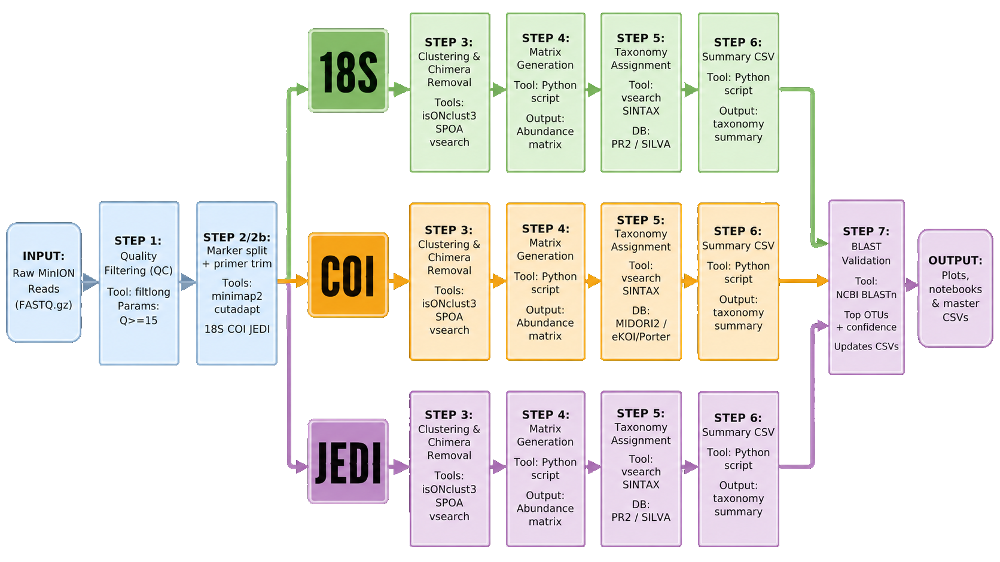

# eDNA Metabarcoding Pipeline for MinION

This pipeline processes multi-marker amplicon sequencing data (18S rRNA, COI, and JEDI) from aquatic or terrestrial eDNA samples sequenced on Oxford Nanopore MinION. It takes raw FASTQ files and produces abundance-based OTU matrices with taxonomy assignments ready for statistical analysis.

## Supported Markers

| Marker | Target Gene | Amplicon Size | Typical Use | Default Database |
|--------|------------|---------------|-------------|-----------------|
| **18S** | 18S rRNA | 1,500–2,800 bp | Water eDNA (eukaryotes) | PR2 v5.1.1 |
| **COI** | Cytochrome Oxidase I | 500–900 bp | Water/Soil (invertebrates, Folmer primers) | MIDORI2 |
| **JEDI** | SSU rRNA V4-V5 (515F-Y/926R) | 250–500 bp | Soil eDNA (all domains of life) | PR2 v5.1.1 |

### Available Reference Databases

| Database | Gene | Size | Best For | Setup |
|----------|------|------|----------|-------|
| **PR2 v5.1.1** | 18S rRNA | ~240K seqs | Protists, ciliates, diatoms, plankton | `bash refs/setup_pr2_18s.sh` |
| **SILVA v123** | 18S rRNA | ~1.1 GB UDB | Broad 18S coverage | Manual (see below) |
| **MIDORI2** | COI | 3.1M seqs, 9.4 GB | Broadest COI, best at species level | Manual + `bash refs/build_coi_udb.sh` |
| **eKOI** | COI | 66 MB | Curated eukaryote COI, fast | `bash refs/setup_ekoi_coi.sh` |
| **Porter CO1 v5.1** | COI | 2.2M seqs, 6.8 GB | Good intermediate COI coverage | `bash refs/setup_porter_coi.sh` |

## Key Features

* **Marker-Aware:** Automatically separates 18S, COI, and JEDI reads by amplicon length (minimap2), then validates with primer-based reclassification (cutadapt). Use `--markers` to select markers.
* **Multi-Database:** Supports 5 reference databases with `--db_18S`, `--db_COI`, `--db_JEDI` flags. Defaults to PR2 (18S/JEDI) and MIDORI2 (COI).
* **Noise Reduction:** `filtlong` quality filtering (Q≥15), primer-based read validation, and VSEARCH `uchime_denovo` chimera removal.
* **High Accuracy:** isONclust3 clustering with SPOA consensus to correct ONT sequencing errors.
* **Dual BLAST Validation:** Top 10 most abundant + top 10 highest-confidence OTUs BLASTed against NCBI to validate SINTAX assignments.
* **Taxonomy Ready:** SINTAX classification with confidence scores at all ranks (6 ranks: Phylum → Species).

## Pipeline Overview



### Pipeline Steps

1. **Quality Filtering** (`scripts/1_run_preprocessing.py`) — Filter reads using `filtlong` (mean Q ≥ 15).
2. **Marker Classification** (`scripts/2_classify_markers.py`) — Separate reads by amplicon length via minimap2:
   - 18S: 1500–2800 bp | COI: 500–900 bp | JEDI: 250–500 bp
2b. **Primer Trimming** (`scripts/2b_trim_primers.py`) — Primer-based reclassification + cutadapt trimming. Reads without a recognizable primer are discarded (~12% discard rate).
3. **Clustering + Chimera Detection** (`scripts/3_run_clustering_by_marker.py`) — isONclust3 clustering with SPOA consensus generation, then VSEARCH `uchime_denovo` chimera removal.
4. **Abundance Matrix Generation** (`scripts/4_merge_otu_tables_by_marker.py`) — Create per-sample OTU count tables.
5. **Taxonomy Assignment** (`scripts/5_assign_taxonomy.py`) — SINTAX classification against reference databases.
6. **Comprehensive Summary** (`scripts/7_comprehensive_taxonomy_summary.py`) — Merge abundance + taxonomy into master CSV.
7. **BLAST Validation** (`scripts/6_blast_top_otus.py`) — Top 10 OTUs by abundance + top 10 by confidence, BLASTed against NCBI GenBank. Results written back to the summary CSV.

## Installation and Setup

### 1. Prerequisites

Unix-based system (macOS or Linux). The pipeline runs in a local Conda environment.

### 2. Create the Environment

```bash
# Automated (uses mamba if available, falls back to conda)
bash create_env.sh

# Or manually
conda env create -f environment.yml -p ./env
```

Tools installed via conda: filtlong, vsearch (v2.30+), python 3.10, samtools, cutadapt, biopython, pandas, matplotlib, seaborn.

**External tools (pre-compiled/built, placed in `tools/`):**

> **Upgrading:** Newer versions of these tools are generally backward-compatible. To upgrade, simply replace the binary/folder in `tools/` and re-run the pipeline. The pipeline logs tool versions at startup for reproducibility.

- [minimap2 v2.30+](https://github.com/lh3/minimap2/releases) — Pre-compiled x64 binary for read-to-reference alignment (tested with v2.30; newer versions should work)
- [isONclust3](https://github.com/aljpetri/isONclust3) — Rust-based ONT read clustering (`cargo build --release` or download a release binary if available)

## Database Setup

Reference databases go in `refs/`. The pipeline auto-detects available databases at runtime.

### 18S / JEDI Databases (rRNA)

**PR2 v5.1.1** (recommended — best for protists, ciliates, diatoms):
```bash
bash refs/setup_pr2_18s.sh
```
This downloads PR2 v5.1.1, converts it to SINTAX format using `refs/convert_pr2_to_sintax.py`, and builds the UDB.

**SILVA** (broader coverage, lower resolution):
```bash
cd refs/
# Download from https://www.drive5.com/sintax/ (e.g. v123)
wget https://www.drive5.com/sintax/silva_18s_v123.fa.gz
gunzip silva_18s_v123.fa.gz
../env/bin/vsearch --makeudb_usearch silva_18s_v123.fa --output silva_18S.udb
cd ..
```

### COI Databases

**MIDORI2** (recommended — largest COI database, best at species rank):
1. Download the SINTAX-formatted FASTA from [MIDORI2](https://www.reference-midori.info/download.php) (GB269, CO1, SINTAX format, SP version)
2. Place it in `refs/` as `MIDORI2_UNIQ_NUC_SP_GB269_CO1_SINTAX.fasta`
3. Build the UDB:
```bash
bash refs/build_coi_udb.sh
```

**eKOI** (curated eukaryote COI, small and fast):
```bash
bash refs/setup_ekoi_coi.sh
```
Downloads from [GitHub](https://github.com/rubenmiguens/eKOI_taxonomy_database), converts to SINTAX format, and builds UDB automatically.

**Porter CO1 v5.1** (pre-built, good intermediate coverage):
```bash
bash refs/setup_porter_coi.sh
```
This downloads the pre-built SINTAX UDB from the [CO1Classifier](https://github.com/terrimporter/CO1Classifier) releases.

## How to Run

### Both Datasets (Recommended)

```bash
conda activate ./env

# Run Water (18S+COI) then Soil (JEDI+COI) sequentially
bash scripts/run_both_datasets.sh

# Override databases via CLI arguments:
bash scripts/run_both_datasets.sh --db_18S silva --db_COI ekoi --db_JEDI silva
```

### Single Dataset

```bash
# Water eDNA (18S + COI) — defaults to PR2 + MIDORI2
bash scripts/run_full_pipeline.sh \
    --root data/Water_eDNA_18S_COI_14_01_26/fastq_pass \
    --markers 18S,COI \
    --threads 14

# Soil eDNA (JEDI + COI)
bash scripts/run_full_pipeline.sh \
    --root data/Soil_eDNA_JEDI_COI_14_01_26/fastq_pass \
    --markers JEDI,COI \
    --threads 14

# Override databases explicitly:
bash scripts/run_full_pipeline.sh \
    --root data/Water_eDNA_18S_COI_14_01_26/fastq_pass \
    --markers 18S,COI \
    --db_18S silva --db_COI ekoi \
    --threads 14

# Soil with SILVA + eKOI:
bash scripts/run_full_pipeline.sh \
    --root data/Soil_eDNA_JEDI_COI_14_01_26/fastq_pass \
    --markers JEDI,COI \
    --db_JEDI silva --db_COI ekoi \
    --threads 14
```

Database arguments: `--db_18S` (pr2/silva), `--db_COI` (midori2/ekoi/porter), `--db_JEDI` (pr2/silva). You can also pass a direct path to a `.udb` file.

### Background Mode

```bash
nohup bash scripts/run_full_pipeline.sh \
    --root data/Water_eDNA_18S_COI_14_01_26/fastq_pass \
    --markers 18S,COI --threads 14 \
    > pipeline_water.log 2>&1 &

tail -f pipeline_water.log
```

### Re-run Taxonomy Only

To re-assign taxonomy with a different database without re-running the full pipeline:

```bash
# Re-run with PR2 for 18S and Porter for COI
bash scripts/regenerate_taxonomy.sh --db_18S pr2 --db_COI porter --dataset water

# All options
bash scripts/regenerate_taxonomy.sh --dataset water|soil|both --db_18S DB --db_COI DB --db_JEDI DB
```

### Step-by-Step (For Debugging)

```bash
# Step 1: Quality Filter
python3 scripts/1_run_preprocessing.py \
    --input_files data/sample_01/*.fastq.gz \
    --output_dir out/sample_01

# Step 2: Separate markers
python3 scripts/2_classify_markers.py --input_dir "out/run_name" --markers 18S,COI

# Step 3: Cluster and Remove Chimeras
python3 scripts/3_run_clustering_by_marker.py \
    --input_dir "out/run_name" --markers 18S,COI --threads 12

# Step 4: Create Abundance Matrices
python3 scripts/4_merge_otu_tables_by_marker.py --input_dir "out/run_name"

# Step 5: Assign Taxonomy
python3 scripts/5_assign_taxonomy.py \
    --input_dir "out/run_name" \
    --db_18S refs/pr2_18S.udb \
    --db_COI refs/midori2_COI.udb \
    --threads 12

# Step 6 (optional): BLAST top OTUs
python3 scripts/6_blast_top_otus.py \
    --input_dir "out/run_name" --marker 18S

# Step 7: Generate Final Report
python3 scripts/7_comprehensive_taxonomy_summary.py --input_dir "out/run_name"
```

**Example log:** See [logs_example/](logs_example/) for a complete pipeline execution log.

## Output Files

After the pipeline finishes, results are in `out/<run_name>/`.

| Directory | Contents |
|-----------|----------|
| `merged/` | OTU abundance matrices (raw counts + relative abundance per marker) |
| `temp_clustering/` | Consensus FASTA sequences (chimera-filtered) |
| `taxonomy/` | Per-OTU SINTAX assignments with confidence scores |
| `taxonomy_summary/` | **Master CSVs** — abundance + taxonomy + BLAST merged per marker |
| `logs/` | Per-sample and per-step logs |

The `taxonomy_summary/comprehensive_taxonomy_{marker}.csv` files are ready for direct import into R or Python. Each row is an OTU with columns for: OTU ID, total abundance, per-sample abundances, taxonomy at all ranks with confidence scores, and BLAST results.

## Analysis Notebooks

| Notebook | 18S/JEDI Database | COI Database |
|----------|-------------------|--------------|
| `Water_results_analysis PR2-Porter.ipynb` | PR2 v5.1.1 | Porter CO1 v5.1 |
| `Water_results_analysis PR2-MIDO.ipynb` | PR2 v5.1.1 | MIDORI2 |
| `Water_results_analysis SILV-eKOI.ipynb` | SILVA v123 | eKOI |
| `Soil_results_analysis PR2-Porter.ipynb` | PR2 v5.1.1 | Porter CO1 v5.1 |
| `Soil_results_analysis PR2-MIDO.ipynb` | PR2 v5.1.1 | MIDORI2 |
| `Soil_results_analysis SILV-eKOI.ipynb` | SILVA v123 | eKOI |

Each notebook includes: confidence dashboards, DB performance comparison, taxonomy bar plots, dual BLAST validation (top 10 by abundance + top 10 by confidence), and cross-marker analysis.

## Methodology Notes

- **Nanopore-specific:** No PCR duplicate removal (dereplication) before clustering — Nanopore reads each originate from a unique molecule, so pre-clustering dereplication has no effect.
- **Classification:** Reads are separated by amplicon length and primer recognition. JEDI (250–500 bp) targets the same rRNA gene family as 18S but with different primers (515F-Y/926R), so it uses an 18S/SSU database (PR2 or SILVA), not a COI database.
- **Clustering:** isONclust3 (quality-aware ONT clustering) with SPOA consensus polishing. Chimeras removed with VSEARCH `uchime_denovo`.
- **Confidence filtering:** Taxonomy assignments include per-rank confidence scores (0–1). Analysis notebooks filter at confidence ≥ 0.8 by default.

## Next Steps

### Priority

1. **Automated sample metadata integration:** Parse sample sheets or barcode-to-sample mappings to auto-label results with site names, dates, and conditions.
2. **HTML report generation:** Auto-generate a summary report (species lists, diversity indices, quality stats) after pipeline completion.

### Potential Improvements

3. **Workflow manager (Snakemake/Nextflow):** Convert the bash pipeline into a declarative workflow for automatic parallelization, resumability on failure, and native HPC/cloud scaling.

## Repository Structure

```
├── scripts/                    # Pipeline scripts (steps 1-7) + orchestration
│   ├── 1_run_preprocessing.py
│   ├── 2_classify_markers.py
│   ├── 2b_trim_primers.py      # Primer reclassification + cutadapt trimming
│   ├── 3_run_clustering_by_marker.py
│   ├── 4_merge_otu_tables_by_marker.py
│   ├── 5_assign_taxonomy.py
│   ├── 6_blast_top_otus.py
│   ├── 7_comprehensive_taxonomy_summary.py
│   ├── primers.tsv             # Primer sequences (editable config)
│   ├── db_tag.py               # DB name tagging utility
│   ├── run_full_pipeline.sh    # Single-dataset orchestrator
│   ├── run_both_datasets.sh    # Water + Soil sequential runner
│   └── regenerate_taxonomy.sh  # Re-run taxonomy with different DBs
├── refs/                       # Reference databases + setup scripts
│   ├── *.udb                   # VSEARCH binary databases
│   ├── setup_pr2_18s.sh        # Download + build PR2
│   ├── setup_porter_coi.sh     # Download + build Porter COI
│   ├── build_coi_udb.sh        # Build MIDORI2 UDB from FASTA
│   ├── convert_pr2_to_sintax.py
│   └── convert_ekoi_to_sintax.py
├── data/                       # Raw FASTQ data (not tracked)
├── out/                        # Pipeline outputs (not tracked)
├── create_env.sh               # Environment setup
├── environment.yml             # Conda environment spec
├── *_results_analysis *.ipynb  # Analysis notebooks (6 DB combinations)
└── Presentation_eDNA_Results.ipynb  # Presentation notebook
```

## License and Credits

Developed for the [Genorobotics](https://make.epfl.ch/projects/14/make-genorobotics-14) semester project (EPFL).

### References

#### Tools

- **minimap2:** Li, H. (2018). Minimap2: pairwise alignment for nucleotide sequences. *Bioinformatics*, 34(18):3094–3100. doi:[10.1093/bioinformatics/bty191](https://doi.org/10.1093/bioinformatics/bty191). GitHub: [lh3/minimap2](https://github.com/lh3/minimap2)
- **isONclust3:** Petri, A.J., Sahlin, K. (2025). De novo clustering of large long-read transcriptome datasets with isONclust3. *Bioinformatics*, btaf207. doi:[10.1093/bioinformatics/btaf207](https://doi.org/10.1093/bioinformatics/btaf207). GitHub: [aljpetri/isONclust3](https://github.com/aljpetri/isONclust3)
- **SPOA:** Vaser, R., Sović, I., Nagarajan, N., Šikić, M. (2017). Fast and accurate de novo genome assembly from long uncorrected reads. *Genome Research*, 27(5):737–746. doi:[10.1101/gr.214270.116](https://doi.org/10.1101/gr.214270.116). GitHub: [rvaser/spoa](https://github.com/rvaser/spoa)
- **VSEARCH:** Rognes, T., Flouri, T., Nichols, B., Quince, C., Mahé, F. (2016). VSEARCH: a versatile open source tool for metagenomics. *PeerJ*, 4:e2584. doi:[10.7717/peerj.2584](https://doi.org/10.7717/peerj.2584). GitHub: [torognes/vsearch](https://github.com/torognes/vsearch)
- **cutadapt:** Martin, M. (2011). Cutadapt removes adapter sequences from high-throughput sequencing reads. *EMBnet.journal*, 17(1):10–12. doi:[10.14806/ej.17.1.200](https://doi.org/10.14806/ej.17.1.200)
- **filtlong:** Wick, R. (2021). Filtlong: quality filtering tool for long reads. GitHub: [rrwick/Filtlong](https://github.com/rrwick/Filtlong)
- **ONT-AmpSeq:** The clustering and consensus generation strategy is inspired by the [ONT-AmpSeq pipeline](https://github.com/michoug/ONT-AmpSeq).
- **SINTAX:** Edgar, R.C. (2016). SINTAX: a simple non-Bayesian taxonomy classifier for 16S and ITS sequences. *bioRxiv*, 074161. doi:[10.1101/074161](https://doi.org/10.1101/074161)

#### Databases

- **SILVA Database:** 18S rRNA reference database from [SILVA v123](https://www.arb-silva.de/), pre-formatted for SINTAX available at [USEARCH SINTAX Downloads](https://www.drive5.com/usearch/manual/sintax_downloads.html)
- **eKOI Database:** Gonzalez-Miguens, R., Galvez-Morante, A., Skamnelou, M., Anto, M., Casacuberta, E., Richter, D.J., Vaulot, D., del Campo, J., Ruiz-Trillo, I. (2024). bioRxiv 2024.12.05.626972. doi:[10.1101/2024.12.05.626972](https://doi.org/10.1101/2024.12.05.626972)
- **PR2 Database:** Guillou, L., Bachar, D., Audic, S., Bass, D., Berney, C., Bittner, L., Boutte, C. et al. (2013). [The Protist Ribosomal Reference database (PR<sup>2</sup>): a catalog of unicellular eukaryote Small Sub-Unit rRNA sequences with curated taxonomy](http://nar.oxfordjournals.org/lookup/doi/10.1093/nar/gks1160). *Nucleic Acids Res.* 41:D597–604.
- **MIDORI2 Database:** Machida, R.J., Leray, M., Ho, S.-L., Knowlton, N. (2017). Metazoan mitochondrial gene sequence reference datasets for taxonomic assignment of environmental samples. *Scientific Data*, 4:170027. doi:[10.1038/sdata.2017.27](https://doi.org/10.1038/sdata.2017.27). Website: [reference-midori.info](http://www.reference-midori.info/)
- **Porter CO1 Database:** Porter, T.M. (2017). Eukaryote CO1 Reference Set For The RDP Classifier (v4.0.1). Zenodo. doi:[10.5281/zenodo.4741447](http://doi.org/10.5281/zenodo.4741447)
